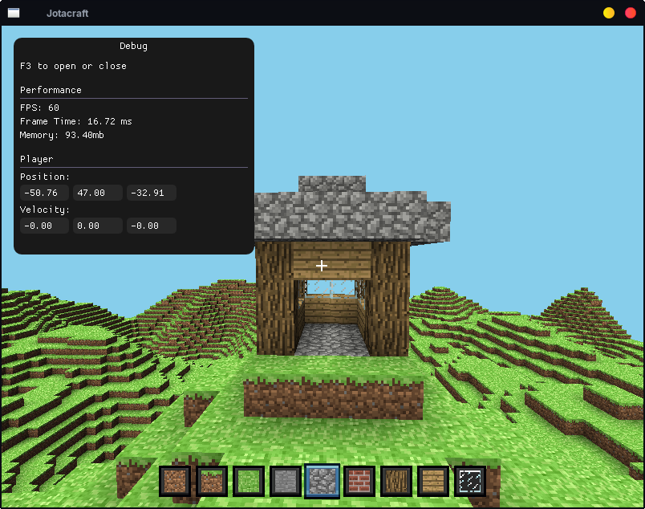

# Jotacraft

*Uma voxel engine inspirada em **Minecraft** escrita em **C++** moderno usando **OpenGL**.*

<p align="center">
  <a href="#">
    
  </a>
</p>

---
<br>

**Jotacraft** foi desenvolvido como um projeto de estudo para entender como funcionam as **voxel engines** internamente, implementando seus principais sistemas **do zero**, sem depender de uma game engine.

> Esse projeto foca em **arquitetura** e **técnicas de renderização** ao invés de recriar o jogo **fielmente**.

---

## Features

- **Mundo infinito composto por `Chunks` e `Voxels`**
- **Geração procedural de terreno**
- **Chunk Meshing**
- **Face Culling**
- **Oclusão de Ambiente (AO)**
- **Iluminação por `Voxel` misturada com `Phong`**
- **Atlas de textura**
- **Camera em primeira pessoa**
- **Física do jogador**
- **Interação com os blocos no mundo (Quebrar e Colocar)**
- **Raycasting**
- **Interface de jogo feita em OpenGL**
- **Interface de depuração feita com ImGui**

---

## Dependências

- [C++20](https://isocpp.org/)
- [OpenGL 4.1 Core](https://www.opengl.org/)
- [GLFW](https://www.glfw.org/)
- [GLAD](https://github.com/Dav1dde/glad)
- [GLM](https://github.com/g-truc/glm)
- [stb_image](https://github.com/nothings/stb)
- [FastNoiseLite](https://github.com/Auburn/FastNoiseLite/)
- [Dear ImGui](https://github.com/ocornut/imgui)
- [CMake](https://cmake.org/)

---

## Estrutura do Projeto

- `assets/`: Abriga todos os recursos da engine.
- `src/`: Abriga todo o código fonte.
- `include/`: Abriga todo os headers.
- `external/`: Abriga todas as dependências.
- `scripts/`: Scripts de compilação **(Linux)**

---

## Build

```bash
git clone https://github.com/JJ0o0/JotacraftGL
cd Jotacraft

cmake -S . -B build
cmake --build build

cd build
./Jotacraft
```

ou execute os scripts em `scripts/`.

> OBS: Para compilar pra sua plataforma, tenha certeza que as dependências necessária estejam instaladas no seu sistema (ex: GLFW e GLM).

---

## Controles

| Tecla | Ação |
|------|--------|
| W A S D | Movimentação |
| Left Shift | Correr |
| Space | Pular |
| Mouse | Olhar |
| Left Click | Quebrar Bloco |
| Right Click | Colocar Bloco |
| 1-9 | Selecionar Bloco |
| F3 | Abrir/Fechar menu de Depuração |
| ESC | Capturar/Liberar o cursor |

---

## Considerações Finais

O objetivo deste projeto foi **compreender os principais conceitos envolvidos na construção de uma voxel engine**, e não desenvolver um clone completo do Minecraft. Diversas funcionalidades ainda podem ser adicionadas, como água, biomas, cavernas, salvamento de mundos e geração multithread.

---

## Licença

Esse projeto está licenciado sob a licença **[MIT](LICENSE)**